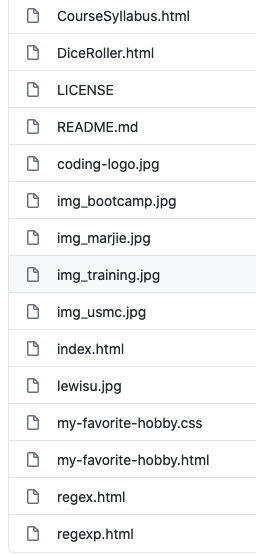

<h1>Software Engineering Sprint 2</h1>
 
 
 

# Introduction

Author: Marjorie Silva
 

Class: Software Engineering
 

Project: Lab 2
 

Email: marjorielsilva@lewisu.edu

## Description

 This project contains the contects of Sprint 2 in my Softeware Engineering class. Throughout
    this Sprint, I created a Landing Page with links to my projects.

 

### Projects

1. Azure Landing Page
 

2. Dice Roller Game
 

3. Course Syllabus
 

4. RegExp Tester
 

#### Instruction

All of my projects are linked to my Azure Landing Page. Simply go to my Landing Page and you can access them through their links.
 

##### Files

